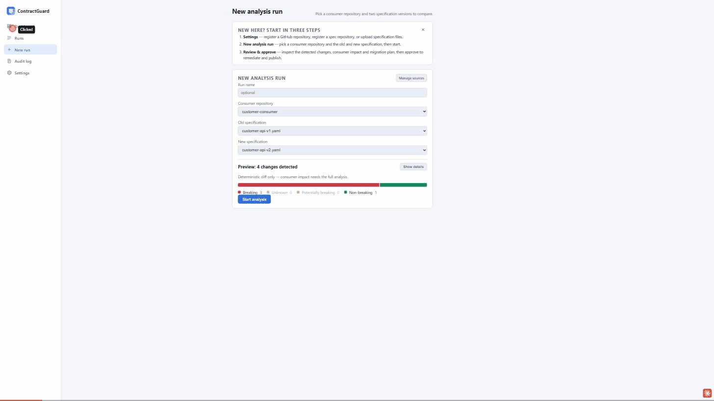

# ContractGuard AI

Local-first agentic tool that compares two OpenAPI specifications, classifies
contract changes, finds affected usages in a Java consumer repository with
file-and-line evidence, produces a migration plan, pauses for human approval,
applies a minimal patch on an isolated Git branch, runs the consumer test
suite (with at most one bounded repair attempt), and produces auditable
Markdown and JSON reports.

Deterministic tools are authoritative for every fact — diffs, evidence, Git
state, patches, test results. The LLM explains, investigates within a bounded
tool loop, plans and proposes code; everything it produces is schema-validated
and enforced by backend state. The default **mock mode** uses a deterministic
scripted gateway, so the whole demo runs without any API key or network.

The web app is organised into five pages — a statistics **Dashboard**, **Runs**
(history and per-run detail), **New run**, an org-wide **Audit log**, and
**Settings** — with dark and light themes:



## Prerequisites

- Java 21 (JDK)
- Git on `PATH`
- Node.js 20+ (frontend)
- Internet access for the first Maven/npm dependency download
- Optional: a local Docker daemon, only to enable sandboxed build validation
  (`contractguard.validation.docker.enabled` — off by default, see
  [Configuration reference](docs/configuration.md#sandboxed-validation))

## Quick start

```bash
scripts/run-demo.sh              # PowerShell: scripts/run-demo.ps1
```

That resets the demo repository, builds and starts the backend
(http://127.0.0.1:7080) and the dashboard (http://localhost:5173).
Or run the steps manually:

```bash
scripts/reset-demo.sh                       # materialise workspace/customer-consumer
cd backend && ./mvnw spring-boot:run        # backend
cd frontend && npm install && npm run dev   # dashboard
```

Containerised alternative — no Java/Node/Maven needed, just Docker:
`docker compose up --build`, then open <http://localhost:5173>. See
[Docker deployment](docs/deployment.md) for configuration (all optional)
and troubleshooting.

Follow [docs/demo-script.md](docs/demo-script.md) for the guided walkthrough
of the bundled scenario (endpoint rename, field rename, enum value removal,
optional field addition), or the [Usage Guide](docs/usage.md) for a full
tour of every feature with screenshots.

## Repository layout

```
backend/       Spring Boot 3 / Java 21 modular monolith (hexagonal, ArchUnit-enforced)
frontend/      React + TypeScript dashboard (Vite, Vitest)
samples/       Bundled OpenAPI specs and the Java consumer source template
scripts/       reset-demo / run-demo helpers
integrations/  CI gate wrappers (GitHub Action, GitLab template)
docs/          Guides, architecture, ADRs, demo script, roadmap
```

## Documentation

- **[Usage Guide](docs/usage.md)** — the full walkthrough with screenshots
  (analyse → investigate → plan → remediate → report → publish), the CI
  gate, remote repositories, specification sources, the audit trail, running
  the test suite, safety guarantees and known limitations.
- **[Configuration Reference](docs/configuration.md)** — sandboxed
  validation, observability (tracing/metrics), using a real LLM provider,
  the full settings table, and database options.
- **[Docker deployment](docs/deployment.md)** — the containerised setup end
  to end, plus troubleshooting.
- **[Demo script](docs/demo-script.md)** — a guided, step-by-step walkthrough
  of the bundled scenario.
- **[Feature list](docs/features.md)** — capability-oriented summary of
  everything the tool does.
- **[Architecture](docs/architecture.md)** · **[ADRs](docs/adr/)** — design
  and the decisions behind it.
- **[Specification](docs/specification.md)** — the original functional/
  non-functional requirements (FR/§ numbering referenced throughout the code
  and other docs).
- **[Roadmap](docs/roadmap.md)** — what's shipped, what's proposed next, and why.
