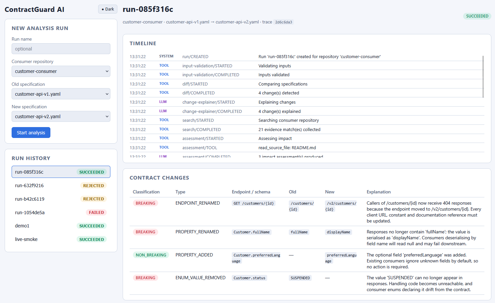
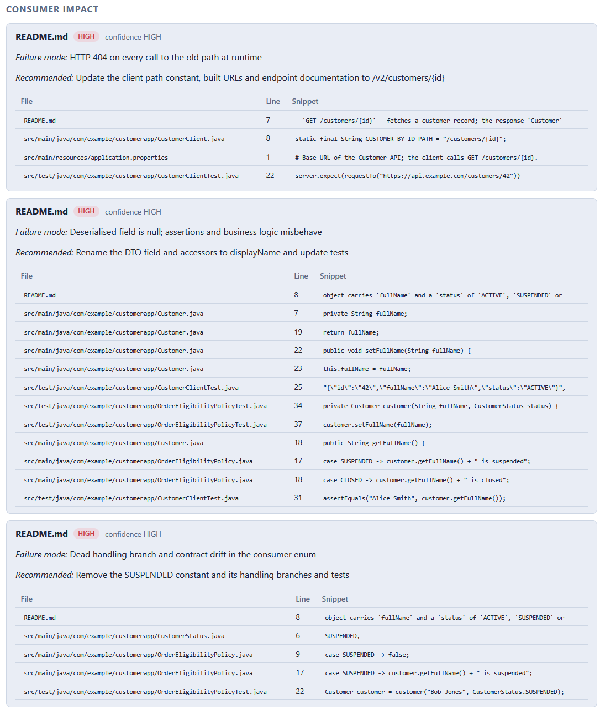
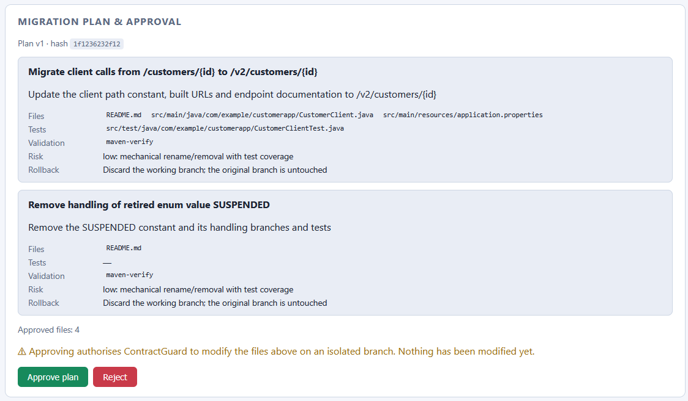
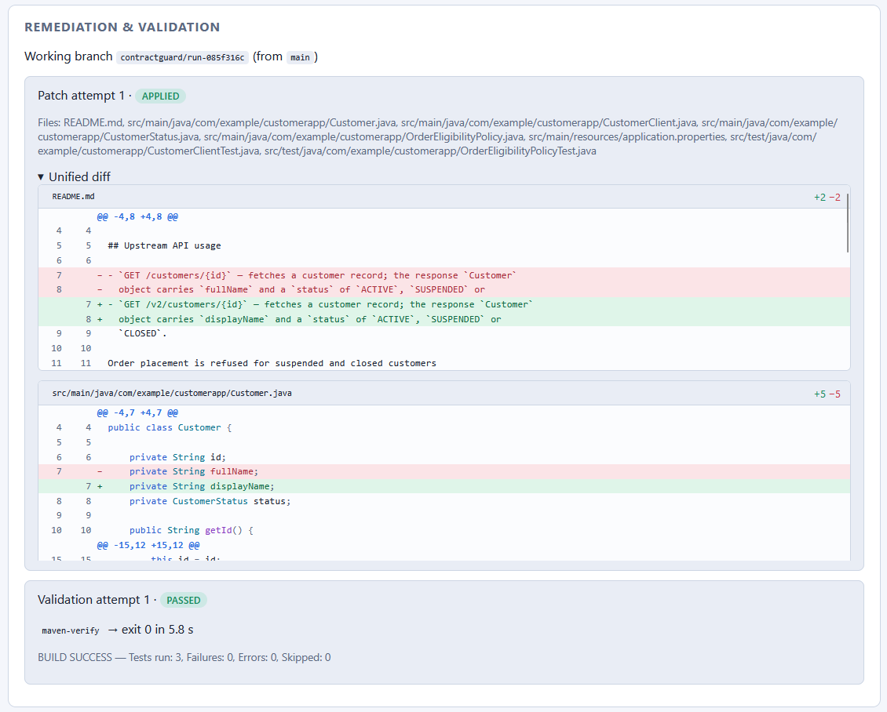
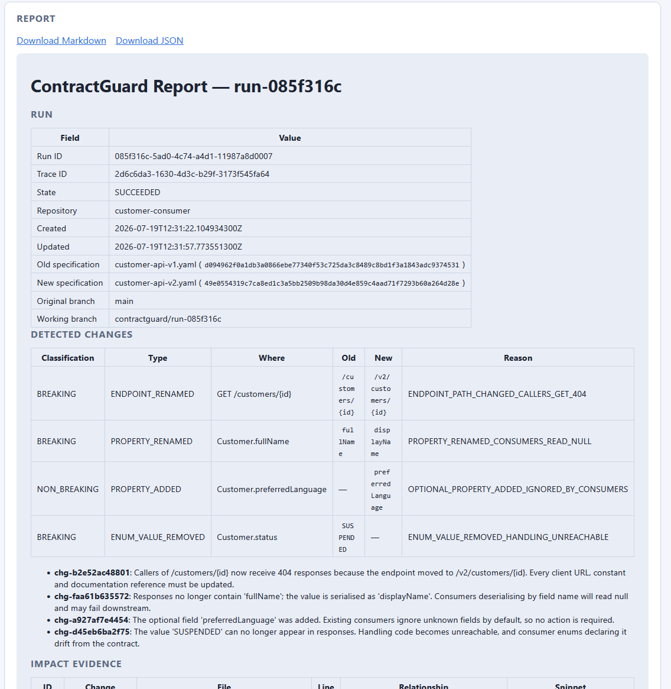

# ContractGuard AI

Local-first agentic tool that compares two OpenAPI specifications, classifies
contract changes, finds affected usages in a Java consumer repository with
file-and-line evidence, produces a migration plan, pauses for human approval,
applies a minimal patch on an isolated Git branch, runs the consumer test
suite (with at most one bounded repair attempt), and produces auditable
Markdown and JSON reports.

Deterministic tools are authoritative for every fact — diffs, evidence, Git
state, patches, test results. The LLM explains, investigates within a bounded
tool loop, plans and proposes code; everything it produces is schema-validated
and enforced by backend state. The default **mock mode** uses a deterministic
scripted gateway, so the whole demo runs without any API key or network.

## How a run flows

A run walks a strict state machine from `CREATED` to a terminal state; every
step is streamed live to the dashboard timeline and persisted for the final
report. The dashboard ships with dark and light themes (toggle in the
sidebar).

### 1 — Analyse: diff, classify, explain

Pick the consumer repository and the old/new specifications, then start the
analysis. The backend validates inputs, computes a deterministic diff of the
two specs, classifies each change (`BREAKING` / `NON_BREAKING` /
`POTENTIALLY_BREAKING` / `UNKNOWN`) by fixed policy, and has the LLM explain
the consumer consequences of each fact it is given — it cannot add or remove
changes. The timeline shows each step as it happens, tagged by who acted
(tool, LLM, human, system).



### 2 — Investigate: evidence-backed consumer impact

Deterministic text search collects file-and-line evidence for every breaking
change, then the impact investigator (a bounded agent with exactly two tools:
`search_repository` and `read_source_file`, limited by a step budget) assesses
severity and failure mode per affected component. Every assessment must cite
collected evidence IDs — uncited claims are rejected by the backend.



### 3 — Plan and approve: the human gate

The migration planner turns assessments into a versioned plan: objectives,
exact files, tests to update, validation command, risk and rollback per item.
Nothing has touched the repository yet. Approval is recorded against the exact
plan hash — if the plan changes, the approval is void; a rejection ends the
run with the repository untouched.



### 4 — Remediate and validate: isolated branch, checked patch

After approval, ContractGuard verifies the repository is clean, creates
`contractguard/run-<id>` off the current branch, and applies a
backend-computed patch restricted to the approved files (verified with
`git apply --check`, secret-scanned, never touching the original branch). The
consumer's own test suite then validates the result; one bounded repair
attempt is allowed after a failed validation. The patch is browsable per file
with git-style line numbers and syntax highlighting.



### 5 — Report: the audit trail

Every run ends with deterministic Markdown and JSON reports rendered from
persisted state — spec hashes, classified changes, evidence, assessments, the
approved plan and decision, patches, validation output, honest limitations and
the full event trace.



## Prerequisites

- Java 21 (JDK)
- Git on `PATH`
- Node.js 20+ (frontend)
- Internet access for the first Maven/npm dependency download

## Quick start

```bash
scripts/run-demo.sh              # PowerShell: scripts/run-demo.ps1
```

That resets the demo repository, builds and starts the backend
(http://127.0.0.1:7080) and the dashboard (http://localhost:5173).
Or run the steps manually:

```bash
scripts/reset-demo.sh                       # materialise workspace/customer-consumer
cd backend && ./mvnw spring-boot:run        # backend
cd frontend && npm install && npm run dev   # dashboard
```

Containerised alternative: `docker compose up --build`, then open
<http://localhost:5173>.

Follow [docs/demo-script.md](docs/demo-script.md) for the guided walkthrough
of the bundled scenario (endpoint rename, field rename, enum value removal,
optional field addition).

## Using a real LLM

Automated tests and the default demo never call a live model. To run the
agents against an OpenAI-compatible endpoint:

```bash
export CONTRACTGUARD_LLM_API_KEY=...        # never committed, redacted from logs
cd backend
./mvnw spring-boot:run -Dspring-boot.run.arguments=--contractguard.llm.provider=openai
```

## Configuration reference

All settings live under `contractguard.*` in
[backend/src/main/resources/application.yml](backend/src/main/resources/application.yml):

| Key | Default | Purpose |
|---|---|---|
| `workspace.roots` | `../workspace` | Directories whose direct child Git repositories are analysable |
| `storage.directory` | `../data` | Embedded database + run artifacts |
| `specs.directory` | `../samples/openapi` | Specifications offered in run setup |
| `llm.provider` | `mock` | `mock` (deterministic) or `openai` |
| `llm.base-url` / `llm.api-key` / `llm.model` | env-driven | OpenAI-compatible endpoint |
| `llm.timeout`, `llm.max-tokens`, `llm.temperature` | 60s / 4096 / 0.0 | Call bounds |
| `llm.max-workflow-steps` | 20 | Investigator tool-loop budget |
| `validation.command-key` | `maven-verify` | Only allow-listed validation command |
| `validation.timeout` / `validation.max-output-bytes` | 15m / 1MB | Build bounds |

## Verification

```bash
# Backend: unit, adapter, API, agent and architecture tests + coverage,
# Checkstyle and SpotBugs (all build-breaking)
cd backend && ./mvnw verify

# Backend incl. the full end-to-end demo test (real git + real mvnw verify)
cd backend && ./mvnw verify -Pe2e

# Frontend: lint, tests with coverage, production build
cd frontend && npm ci && npm run lint && npm run test:coverage && npm run build
```

CI (`.github/workflows/ci.yml`) runs all of the above from a clean checkout.

## Repository layout

```
backend/    Spring Boot 3 / Java 21 modular monolith (hexagonal, ArchUnit-enforced)
frontend/   React + TypeScript dashboard (Vite, Vitest)
samples/    Bundled OpenAPI specs and the Java consumer source template
scripts/    reset-demo / run-demo helpers
docs/       Requirements, architecture, ADRs, demo script, implementation plan
```

## Safety guarantees

- No source modification before a recorded human approval of the exact plan
  hash; a changed plan invalidates approval.
- Repository access confined to workspace roots; symlink escapes and likely
  secret files rejected; vendored build tooling never becomes evidence.
- Patches are computed by the backend, verified with `git apply --check`,
  restricted to approved files, and rejected if credential-shaped content
  appears. All mutations happen on `contractguard/run-<id>`; the original
  branch is never touched and no remote operation exists in the codebase.
- Process execution uses fixed argument arrays with timeouts and output caps;
  model output is never executed.
- At most one repair attempt after a failed validation, enforced structurally.

## Known limitations

- Automated remediation covers endpoint renames, property renames and enum
  value removals; other breaking categories are reported with evidence but
  migrated manually.
- Evidence collection is text-search based; dynamically constructed
  references can be missed.
- One repository, Maven builds and OpenAPI 3.x only (see requirements §4).
- Resuming a run interrupted mid-flight is not supported; such runs are
  finalised as FAILED on restart with an explanatory message.

## Documentation

- [Architecture](docs/architecture.md) · [ADRs](docs/adr/)
- [Implementation plan](docs/implementation-plan.md)
- [Demo script & troubleshooting](docs/demo-script.md)
- [Requirements](docs/contractguard-requirements.md)
