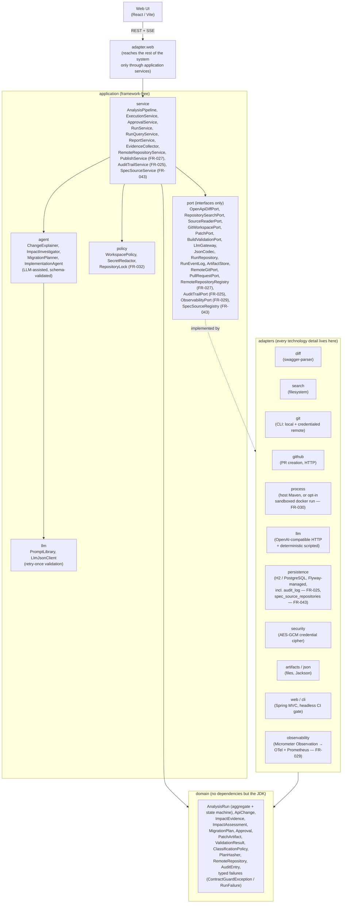
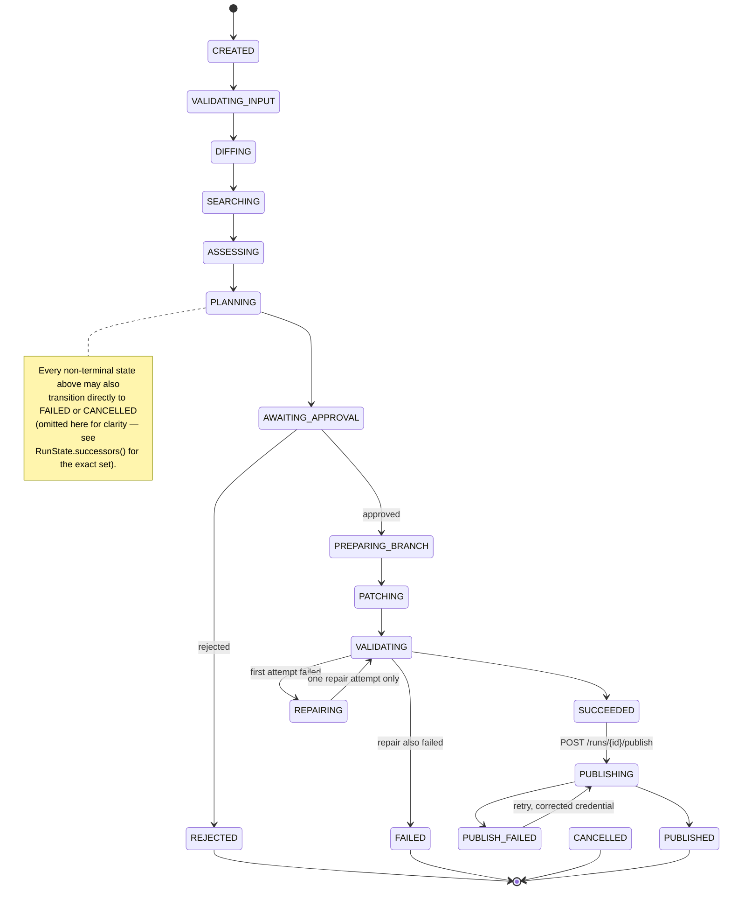
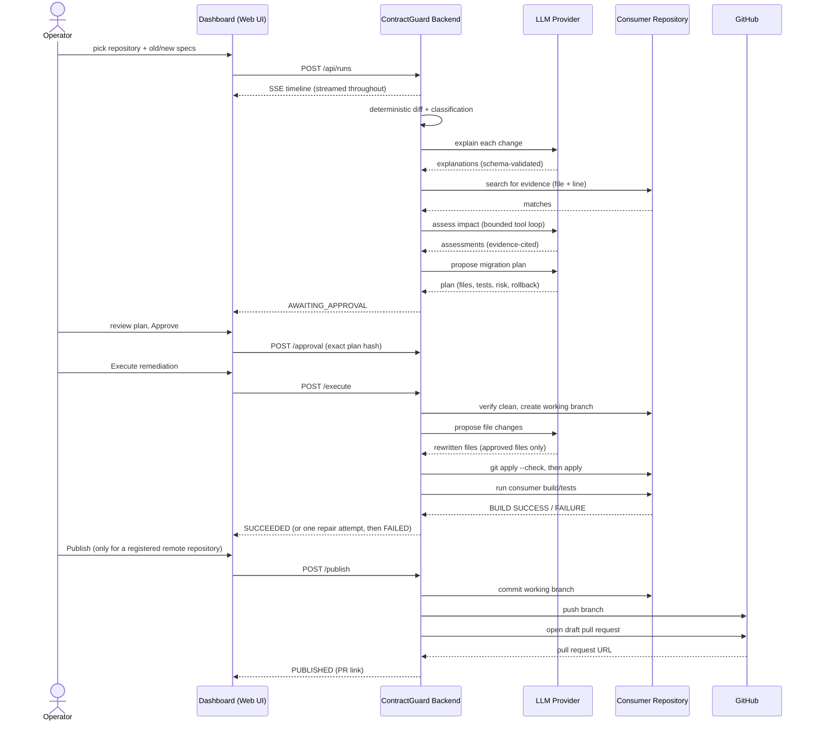

# ContractGuard AI — Architecture

## Overview

ContractGuard is a modular monolith with hexagonal architecture: a
framework-free domain core, an application layer that orchestrates through
ports, and adapters that hold every technology detail (Spring, H2,
swagger-parser, java-diff-utils, the git CLI, process execution, the LLM
HTTP API).

Layering is enforced by a build-breaking ArchUnit suite
(`HexagonalArchitectureTest`): domain depends on nothing but the JDK,
application depends only on domain and its own ports, and the web adapter
reaches the rest of the system exclusively through application services —
the dotted "implemented by" edge above is the only place adapters and
application ever meet.

## Workflow state machine

`RunState` encodes the only legal transitions; `AnalysisRun.transitionTo`
rejects everything else. The single entry into any mutating state
(`PREPARING_BRANCH`) is `AWAITING_APPROVAL`, and `AnalysisRun.recordApproval`
only accepts a decision whose plan hash matches the current plan — the
approval gate is a backend invariant, not UI behaviour.

`SUCCEEDED` and `PUBLISH_FAILED` are terminal for the analysis/execution
pipeline but remain publishable: `PublishService` only enters `PUBLISHING`
from an explicit `POST /runs/{id}/publish`, mirroring the approval gate — a
remediation is never pushed or opened as a pull request automatically.

**On restart** (FR-032, ADR-0009): `RunState`'s transitions are one-shot —
no state lists itself as a valid target — which is exactly what makes an
interrupted run's recovery safe rather than a design gap. A run still
`CREATED` (nothing mutated) is re-dispatched from scratch; a run in
`AWAITING_APPROVAL` is left untouched (nothing was in flight); every other
non-terminal state is finalised as `FAILED` with a clean remediation
message — deliberately not resumed mid-mutation.

## Actors and integration

One full cycle — analysis through an optional publish — and every actor it
touches. The dashboard never talks to the LLM, Git or GitHub directly; it
only ever calls the backend, which is the sole point of contact for every
external system.

Every arrow above is also an audited fact: the deterministic steps (diff,
search, patch, build) are authoritative and never revised by the LLM; the
LLM-assisted steps are always schema-validated with one retry before a typed
failure; and every state transition, approval decision and repository
mutation is written to the append-only audit log (FR-025) regardless of
which actor triggered it.

## Determinism vs. agency

Deterministic and authoritative:

- OpenAPI parsing/diff/classification (`adapter.diff` + `ClassificationPolicy`)
- Repository search and evidence coordinates (`EvidenceCollector`)
- Git status, branching, `git apply --check`, patch application
- Unified-diff construction (computed by the backend from file contents)
- Build validation (`mvnw verify` through the command allow-list)
- Reports (rendered from the persisted aggregate)

LLM-assisted, always schema-validated with one retry then typed failure:

- Change explanation (cannot alter facts; one explanation per change ID)
- Impact investigation — a bounded tool loop restricted to
  `search_repository` / `read_source_file`; unregistered tools are rejected;
  every assessment must cite existing evidence IDs
- Migration planning — only evidence-backed files, only allow-listed
  validation commands
- Implementation/repair — returns complete file contents for approved files
  only; the diff is computed and safety-checked by tools

Mock mode (default) swaps only the `LlmGateway` implementation for a
deterministic scripted gateway; every validation path stays identical.

## Safety model

- All filesystem access flows through `WorkspacePolicy`: canonical-path
  containment, symlink-escape rejection, secret-file blocking.
- All process execution flows through `ProcessRunner` with fixed argument
  arrays, timeouts and output caps; no shell strings exist.
- `SecretRedactor` scrubs LLM payloads, stored logs, and rejects patches
  containing credential-shaped content.
- Patches are checked (`git apply --check`, binary rejection, blocked-file
  rejection, approved-path allow-list) before application, and are stored as
  artifacts either way.
- The MVP never commits, merges, pushes, rebases, resets, tags or touches
  remotes; those operations do not exist on any port.

## Persistence

The run aggregate is stored as a versioned JSON document plus an append-only
`run_events` table (ADR-0004). Two engines are supported behind the same
JDBC adapters: embedded H2 (file mode, the local default) and PostgreSQL for
server deployments (`postgres` Spring profile; ADR-0006). The schema is
managed by Flyway with vendor-specific migrations; databases that predate
Flyway are baselined in place. Large artifacts (patches, validation logs,
reports) live in run-scoped directories under the storage root. Completed
runs survive restarts; in-flight runs are finalised as FAILED on startup
with an explanatory failure. An optional retention window purges finished
runs, their events and artifacts after a configurable number of days.

## Observability

Every run has a trace ID; every step, tool call, LLM call (with prompt
name/version), approval and mutation appends a structured event. The event
log powers the SSE stream (with `Last-Event-ID` replay), the UI trace
timeline, and the report's trace section.

External observability (FR-029, ADR-0011) sits behind `ObservabilityPort`:
`AnalysisPipeline`, `ExecutionService`, `PublishService` and `LlmJsonClient`
wrap each named step in a span via the port, kept framework-free like every
other application-layer dependency; `adapter.observability.
MicrometerObservability` turns those spans into both OpenTelemetry traces
and Prometheus `Timer` metrics from the same instrumentation call
(Micrometer's `Observation` API). `MetricsRecordingAuditTrail` decorates the
FR-025 audit trail to derive a `runs by state` counter from the existing
state-transition record, without any application-service change. Spans
export to the log by default (no external collector required); Prometheus
scraping and Kubernetes-style health/readiness probes are exposed via Spring
Boot Actuator (`/actuator/prometheus`, `/actuator/health/{liveness,
readiness}`). Structured JSON logging is not yet built — see ADR-0011.

See the ADRs in [docs/adr](adr/) for the reasoning behind the major choices.
