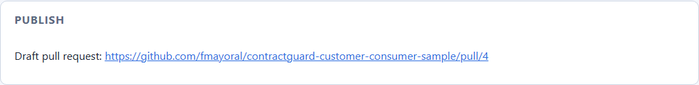

# ContractGuard AI — Demo Script

A guided walkthrough of the bundled scenario: the Customer API renames an
endpoint and a field, retires an enum value, and adds an optional field; the
bundled Spring Boot consumer is analysed, a migration plan is approved, and
ContractGuard remediates the consumer on an isolated branch until
`mvnw verify` passes.

## 1. Prerequisites

- Java 21 on `PATH` (or `JAVA_HOME` pointing at a JDK 21)
- Git on `PATH`
- Node.js 20+ (for the dashboard)
- First run downloads Maven/npm dependencies; allow a few minutes.

## 2. Reset the demo repository

```bash
scripts/reset-demo.sh          # PowerShell: scripts/reset-demo.ps1
```

This copies `samples/customer-consumer` into `workspace/customer-consumer`
and creates a fresh Git repository there with a single commit. Re-run it any
time to discard demo mutations (FR-022).

## 3. Start the backend

```bash
cd backend
./mvnw spring-boot:run           # Windows: mvnw.cmd spring-boot:run
```

The API listens on `http://127.0.0.1:7080` (loopback only). The default LLM
provider is the deterministic mock — no API key needed. To use a real
OpenAI-compatible endpoint instead:

```bash
export CONTRACTGUARD_LLM_API_KEY=sk-...
./mvnw spring-boot:run -Dspring-boot.run.arguments=--contractguard.llm.provider=openai
```

## 4. Start the dashboard

```bash
cd frontend
npm install
npm run dev
```

Open <http://localhost:5173>.

## 5. Run the analysis

1. In **New analysis run**, keep `customer-consumer`,
   `customer-api-v1.yaml` (old) and `customer-api-v2.yaml` (new) — as soon
   as both specifications are selected, the **Preview** card shows "4
   changes detected" with a breaking/non-breaking breakdown, computed
   instantly with no repository and no LLM involved; press **Show details**
   to expand the full change list. Name the run and press **Start analysis**.
2. Watch the timeline stream: input validation, deterministic diff, the LLM
   change explainer, repository search, the investigator's bounded tool
   calls, and planning.
3. **Contract changes** shows exactly four changes:
   `ENDPOINT_RENAMED` (breaking), `PROPERTY_RENAMED` (breaking),
   `ENUM_VALUE_REMOVED` (breaking), `PROPERTY_ADDED` (non-breaking).
4. **Consumer impact** lists the affected files with line numbers and
   snippets — client, DTO, enum, business rule, tests and README.

## 6. Approve and execute

1. Review the **Migration plan**: objectives, exact files, tests, risk,
   rollback and the plan hash. Nothing has been modified yet.
2. Press **Approve plan** (the decision is recorded against the plan hash;
   a stale hash is rejected with HTTP 409).
3. Press **Execute remediation**. ContractGuard verifies the repository is
   clean, creates `contractguard/run-<id>`, generates the patch, verifies it
   with `git apply --check`, applies it, and runs `./mvnw verify` in the
   consumer.
4. **Remediation & validation** shows the branch, the unified diff, and the
   test outcome (`BUILD SUCCESS`, 3 tests — the retired SUSPENDED scenario
   test was removed with the enum value).

## 7. Review the results

- Load the **Report** and download the Markdown/JSON artifacts.
- Load the **Audit trail** section on the same page — every state
  transition, the approval decision with its plan hash, and the branch/patch
  mutations, all principal-attributed.
- Inspect the consumer: `git -C workspace/customer-consumer log --oneline`
  shows the original commit only; `git -C workspace/customer-consumer diff main`
  shows the applied patch on the working branch. `main` is untouched, and no
  remote was ever contacted.

## 8. Things worth demonstrating

- **Rejection path**: start a second run and press **Reject** — the run ends
  `REJECTED` and the repository is untouched.
- **Dirty-repository guard**: edit any file in `workspace/customer-consumer`
  before pressing Execute; execution fails with `DIRTY_REPOSITORY` and a
  clear remediation hint.
- **Approval integrity**: `POST /api/runs/{id}/approval` with a wrong
  `planHash` returns HTTP 409 `APPROVAL_MISMATCH`.
- **Run history**: restart the backend — completed runs and their reports
  remain available.
- **Run again**: from the finished run's detail page, press **Run again**
  (next to the status badge) — New Run opens with `customer-consumer` and
  both specifications already selected, ready to start immediately.
- **Site-wide notification**: start a run, then navigate away to the
  Dashboard or Settings — the moment it reaches `AWAITING_APPROVAL` a toast
  appears wherever you are; clicking it jumps straight to the plan. The same
  toast fires again on `SUCCEEDED`/`FAILED`, deep-linking to Publish or the
  failure explanation respectively.
- **Audit log**: open the **Audit log** page for the org-wide view across
  every run, and filter it by repository or event type. Optionally set
  `CONTRACTGUARD_NOTIFICATIONS_WEBHOOK_URL` (see
  [Outbound notifications](configuration.md#outbound-notifications)) before
  starting the backend to also see the same events land on a real webhook.

## 9. Test remote repositories and publishing (FR-027)

You need a real GitHub repository you control and a personal access token
with `repo` scope (a small throwaway repo is ideal, since ContractGuard will
open a real draft PR against it).

1. Generate a master key for encrypting stored credentials and restart the
   backend with it set (it can also just be exported before step 3 of
   section 3 above):

   ```bash
   export CONTRACTGUARD_CREDENTIAL_KEY=$(openssl rand -base64 32)
   ```

2. In the web app, open the **Settings** page, then under "Consumer
   repositories" fill in a repository ID, the clone URL, default branch and
   your token, and press **Register repository**. Go to **New run** — it now
   appears in the **Consumer repository** picker under "Registered GitHub
   repositories" — select it.

   Equivalently, over the API:

   ```bash
   curl -s -X POST http://127.0.0.1:7080/api/repositories/remote \
     -H 'Content-Type: application/json' \
     -d '{"repositoryId":"my-remote-consumer",
          "cloneUrl":"https://github.com/<you>/<repo>",
          "defaultBranch":"main","token":"ghp_..."}' | jq
   ```

   Expect `201` with `{repositoryId, owner, name, defaultBranch, registeredAt}`
   — the token itself is never echoed back or logged.

3. Start the run as in section 5. The first request triggers a clone into
   `storage.directory/remote-cache/<repositoryId>/`; watch the timeline or
   the backend log for clone activity, or just check the directory appears
   on disk.
4. Approve and execute as in section 6. The run should reach `SUCCEEDED`,
   and a **Publish** card appears below Remediation & validation.
5. Press **Publish (push & open draft PR)**. Once the run reaches
   `PUBLISHED`, the card shows the draft PR link directly — open it to
   confirm the detected changes and evidence are linked back into your
   repository at the remediation branch. Equivalently:

   ```bash
   curl -s -X POST http://127.0.0.1:7080/api/runs/<runId>/publish | jq
   ```

6. Failure path worth exercising: revoke the token (or use one without
   `repo` scope) and publish again — the card shows `PUBLISH_FAILED` with
   the failure message and a **Retry publish** button; retrying with a
   corrected token succeeds without re-running analysis or execution.



## 10. Test specification sources and upload (FR-043)

The **Settings** page offers three ways to get old/new specs in front of a
run, no filesystem or deployment access required for any of them; the
**New run** form itself only ever picks from what's already registered.

1. Open **Settings**.
2. **Upload**: under "Uploaded specifications", choose a `.yaml`/`.yml`/
   `.json` file — it appears immediately in that list. Back on **New run**,
   whichever of old/new is still unset gets filled with it automatically
   (never overwriting a choice you already made).
3. **Register a spec repository**: under "Specification repositories",
   supply a clone URL and default branch. Unlike consumer repository
   registration, **the token is optional** — try registering a public
   repository (e.g. a repo containing just your OpenAPI YAML files) with the
   token field left blank:

   ```bash
   curl -s -X POST http://127.0.0.1:7080/api/spec-sources \
     -H 'Content-Type: application/json' \
     -d '{"repositoryId":"openapi-specs",
          "cloneUrl":"https://github.com/<you>/<specs-repo>",
          "defaultBranch":"main"}' | jq
   ```

   Its files appear in the picker under "From openapi-specs" once the clone
   completes (every subsequent load of the setup screen refreshes it, so
   there's no separate "sync" step).
4. Failure path worth exercising: register a spec source with a clone URL
   that doesn't exist, or a private repo with no/an invalid token. The setup
   screen still loads normally — that one source just contributes no files,
   and a hint under the picker names it as having "contributed no files."
5. Go to **New run** and start the run exactly as in section 5 above; the
   analysis works identically regardless of where the specs came from.

## 11. Test deregistration (FR-044)

1. Open **Settings**. Each registered remote repository and spec source,
   and each uploaded specification, has a **Remove** button next to it
   (local workspace repositories and bundled specs don't — they aren't
   registrations).
2. Remove the repository registered in section 9: press **Remove** next to
   it, confirm the dialog. It disappears from the list and from the
   **Consumer repository** picker; its local clone cache
   (`storage.directory/remote-cache/<repositoryId>/`) is deleted too, so
   re-registering the same ID with a corrected URL or token never reuses a
   stale checkout.
3. Equivalently, over the API:

   ```bash
   curl -s -X DELETE http://127.0.0.1:7080/api/repositories/remote/my-remote-consumer -w '%{http_code}\n'
   curl -s -X DELETE http://127.0.0.1:7080/api/spec-sources/openapi-specs -w '%{http_code}\n'
   curl -s -X DELETE http://127.0.0.1:7080/api/specs/customer-api-v2.yaml -w '%{http_code}\n'
   ```

   Each returns `204` on success and is a no-op (also `204`) if the ID was
   never registered.

## Troubleshooting

| Symptom | Fix |
|---|---|
| `No repositories found` in the UI | Run `scripts/reset-demo.sh` |
| Port 7080 already in use | Start with `--server.port=<free port>` and set the Vite proxy target in `frontend/vite.config.ts` accordingly. 8080 is avoided by default (NVIDIA Broadcast and similar tools squat on it); on Windows also check `netsh interface ipv4 show excludedportrange protocol=tcp` — Hyper-V reserves ranges that fail binds with "port in use" while nothing is listening |
| Validation timeout on first run | The consumer's first `mvnw verify` downloads dependencies; re-run, or raise `contractguard.validation.timeout` |
| Run failed with `REPOSITORY_BUSY` | Another run is active on the repository; wait or restart the backend |
| Stale demo state | Re-run `scripts/reset-demo.sh` |
| `CREDENTIAL_KEY_NOT_CONFIGURED` registering a remote repository | Set `CONTRACTGUARD_CREDENTIAL_KEY` (base64, 32 bytes — `openssl rand -base64 32`) before registering. Not needed for a spec source with no token (ADR-0012) |
| `REMOTE_REPOSITORY_NOT_REGISTERED` on publish | The run's `repositoryId` was never registered via `POST /api/repositories/remote`; local-workspace runs cannot be published |
| Publish fails with `REMOTE_GIT_FAILURE` | Check the token has `repo` scope and the default branch name is correct; the run moves to `PUBLISH_FAILED` and can be retried with `POST .../publish` once fixed |
| A registered spec source shows no files | Check the clone URL, default branch and (if private) token; the setup screen names sources that contributed nothing rather than failing outright |
