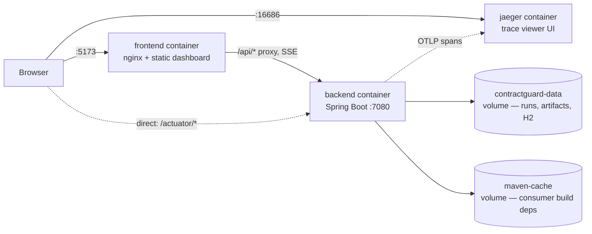

# ContractGuard AI — Docker Deployment

The fastest way to see the whole product working, with nothing installed
except Docker.

## 1. Prerequisites

- Docker Desktop (or the Docker Engine + Compose plugin) running
- Nothing else — no Java, Node, Maven or API keys required for the default
  demo path

## 2. Start it

```bash
docker compose up --build
```

Three containers come up:

| Container | What it is | Reachable at |
|---|---|---|
| `backend` | Spring Boot API, mock LLM, demo repository materialised on start | <http://localhost:7080> |
| `frontend` | Static dashboard behind nginx, proxies `/api/*` to the backend | <http://localhost:5173> |
| `jaeger` | Trace viewer; the backend exports every span here by default | <http://localhost:16686> |



Open <http://localhost:5173> and follow
[docs/demo-script.md](demo-script.md) from section 5 onward (sections 1-4
are the non-Docker setup; the containers already did that part). The first
build downloads Maven/npm dependencies and takes a few minutes; subsequent
`docker compose up` runs are fast (dependencies are cached in the
`maven-cache` volume and the image layers).

The `backend` container isn't healthy until Spring Boot has fully started —
`docker compose up` will show `frontend` waiting on `backend`'s healthcheck
before it starts serving. Watch progress with:

```bash
docker compose logs -f backend
```

## 3. Configuration — all of it optional

Copy the template and fill in only what you need:

```bash
cp .env.example .env
```

`docker compose` reads `.env` automatically. Nothing in it is required for
the base demo (mock LLM, local workspace, no external calls). Set values
only when you want to demo a specific feature:

| To demo... | Set in `.env` |
|---|---|
| Real LLM output instead of the deterministic mock | `CONTRACTGUARD_LLM_PROVIDER=openai`, `CONTRACTGUARD_LLM_API_KEY=sk-...` |
| Remote repositories + draft-PR publishing (FR-027) | `CONTRACTGUARD_CREDENTIAL_KEY=$(openssl rand -base64 32)` |
| A real name on audit entries instead of `local-operator` | `CONTRACTGUARD_AUDIT_PRINCIPAL=...` |
| Exporting traces somewhere other than the bundled Jaeger (FR-029) | `MANAGEMENT_OTLP_TRACING_ENDPOINT=http://...:4318/v1/traces`, or `=""` to fall back to log-only export |

After editing `.env`, restart to pick it up:

```bash
docker compose up -d --build
```

## 4. Viewing traces, metrics and health (FR-029)

A trace viewer is bundled and wired up by default — nothing to configure.
After running an analysis (see §2), open <http://localhost:16686>, pick
**contractguard** from the **Service** dropdown, and press **Find Traces**.
Each run produces one trace per phase (`analyse`, and later `execute` /
`publish`), with every named pipeline step — `diff`, `search`, `assessment`,
`planning`, each LLM call — nested underneath as child spans, so a single
trace shows the whole timing breakdown of that phase at a glance.

Health and metrics are reachable directly on the host once the backend port
is published:

```bash
curl http://localhost:7080/actuator/health       # overall + readiness
curl http://localhost:7080/actuator/prometheus   # scrape target
```

To point traces at a different collector instead of the bundled Jaeger (or
disable export entirely), see the `MANAGEMENT_OTLP_TRACING_ENDPOINT` row in
§3 above.

## 5. Resetting and stopping

The backend re-materialises the demo repository from
`samples/customer-consumer` every time its container starts, so a restart is
the fastest way to get a clean consumer checkout:

```bash
docker compose restart backend
```

Runs, reports and the Maven dependency cache persist across restarts in
named volumes (`contractguard-data`, `maven-cache`) — only removing the
volumes clears them:

```bash
docker compose down          # stop, keep volumes (runs/reports survive)
docker compose down -v       # stop and wipe all persisted state
```

## 6. What's intentionally not wired into this setup

- **PostgreSQL** — the containers use embedded H2, matching the zero-setup
  local-first default. The `postgres` Spring profile is fully supported for
  server deployments; see [Database](../README.md#database) in the README
  for running the jar against a real PostgreSQL instance outside this
  compose file.
- **Sandboxed build validation (FR-030)** — `DockerBuildValidationAdapter`
  shells out to a `docker` CLI to run the consumer's own build in a
  container; the `backend` container here has no Docker socket mounted, so
  turning on `contractguard.validation.docker.enabled` inside this compose
  setup will fail. It works when running the backend directly on a host
  that has Docker (see the root [README](../README.md#sandboxed-validation)).
- **TLS / a reverse proxy / authentication** — this compose file is a demo
  and evaluation setup, reachable only from the host running it
  (`127.0.0.1` port bindings). It is not a production hardening pass; see
  the roadmap's FR-024 (authentication) for what's still open there.

## Troubleshooting

| Symptom | Fix |
|---|---|
| `frontend` never becomes reachable | `docker compose logs backend` — it's almost always still waiting on the healthcheck; first start can take a few minutes while dependencies download |
| Port 5173 or 7080 already in use | Stop whatever else is bound to it, or edit the host-side port in `docker-compose.yml` (`"127.0.0.1:<free-port>:..."`) |
| Config changes in `.env` don't seem to apply | `docker compose up -d --build` — plain `docker compose up` without `--build`/recreating an existing running container won't pick up new environment values |
| Want a completely clean slate | `docker compose down -v` then `docker compose up --build` |
| `CREDENTIAL_KEY_NOT_CONFIGURED` registering a remote repository | Set `CONTRACTGUARD_CREDENTIAL_KEY` in `.env` (see §3 above) and recreate the backend container |
| No traces showing up in Jaeger | Run at least one analysis first (span export only happens once something runs); confirm `docker compose ps` shows `jaeger` up, and that `.env` hasn't overridden `MANAGEMENT_OTLP_TRACING_ENDPOINT` to somewhere else |
