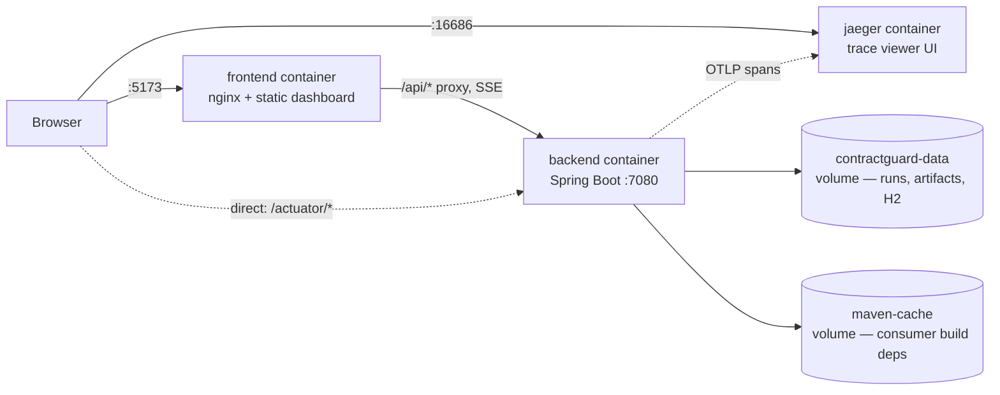

# ContractGuard AI — Docker Deployment

The fastest way to see the whole product working, with nothing installed
except Docker.

## 1. Prerequisites

- Docker Desktop (or the Docker Engine + Compose plugin) running
- Nothing else — no Java, Node, Maven or API keys required for the default
  demo path

## 2. Start it

```bash
docker compose up --build
```

Three containers come up:

| Container | What it is | Reachable at |
|---|---|---|
| `backend` | Spring Boot API, mock LLM, demo repository materialised on start | <http://localhost:7080> |
| `frontend` | Static dashboard behind nginx, proxies `/api/*` to the backend | <http://localhost:5173> |
| `jaeger` | Trace viewer; the backend exports every span here by default | <http://localhost:16686> |



Open <http://localhost:5173> and follow
[docs/demo-script.md](demo-script.md) from section 5 onward (sections 1-4
are the non-Docker setup; the containers already did that part). The first
build downloads Maven/npm dependencies and takes a few minutes; subsequent
`docker compose up` runs are fast (dependencies are cached in the
`maven-cache` volume and the image layers).

The `backend` container isn't healthy until Spring Boot has fully started —
`docker compose up` will show `frontend` waiting on `backend`'s healthcheck
before it starts serving. Watch progress with:

```bash
docker compose logs -f backend
```

## 3. Configuration — all of it optional

Copy the template and fill in only what you need:

```bash
cp .env.example .env
```

`docker compose` reads `.env` automatically. Nothing in it is required for
the base demo (mock LLM, local workspace, no external calls). Set values
only when you want to demo a specific feature:

| To demo... | Set in `.env` |
|---|---|
| Real LLM output instead of the deterministic mock | `CONTRACTGUARD_LLM_PROVIDER=openai`, `CONTRACTGUARD_LLM_API_KEY=sk-...` |
| Remote repositories + draft-PR publishing (FR-027) | `CONTRACTGUARD_CREDENTIAL_KEY=$(openssl rand -base64 32)` |
| A real name on audit entries instead of `local-operator` | `CONTRACTGUARD_AUDIT_PRINCIPAL=...` |
| Exporting traces somewhere other than the bundled Jaeger (FR-029) | `MANAGEMENT_OTLP_TRACING_ENDPOINT=http://...:4318/v1/traces`, or `=""` to fall back to log-only export |
| Only your own registered repositories/specs in the picker, no bundled demo content | `CONTRACTGUARD_DEMO_CONTENT=false` |

After editing `.env`, restart to pick it up:

```bash
docker compose up -d --build
```

## 4. Viewing traces, metrics and health (FR-029)

A trace viewer is bundled and wired up by default — nothing to configure.
After running an analysis (see §2), open <http://localhost:16686>, pick
**contractguard** from the **Service** dropdown, and press **Find Traces**.
Each run produces one trace per phase (`analyse`, and later `execute` /
`publish`), with every named pipeline step — `diff`, `search`, `assessment`,
`planning`, each LLM call — nested underneath as child spans, so a single
trace shows the whole timing breakdown of that phase at a glance.

Health and metrics are reachable directly on the host once the backend port
is published:

```bash
curl http://localhost:7080/actuator/health       # overall + readiness
curl http://localhost:7080/actuator/prometheus   # scrape target
```

To point traces at a different collector instead of the bundled Jaeger (or
disable export entirely), see the `MANAGEMENT_OTLP_TRACING_ENDPOINT` row in
§3 above.

## 5. Resetting and stopping

The backend re-materialises the demo repository from
`samples/customer-consumer` every time its container starts, so a restart is
the fastest way to get a clean consumer checkout:

```bash
docker compose restart backend
```

Set `CONTRACTGUARD_DEMO_CONTENT=false` (§3) to stop that re-materialisation
entirely once you're working with your own registered repositories/specs —
the local workspace and specs directory start empty instead.

Runs, reports and the Maven dependency cache persist across restarts in
named volumes (`contractguard-data`, `maven-cache`) — only removing the
volumes clears them:

```bash
docker compose down          # stop, keep volumes (runs/reports survive)
docker compose down -v       # stop and wipe all persisted state
```

## 6. What's intentionally not wired into this setup

- **PostgreSQL** — the containers use embedded H2, matching the zero-setup
  local-first default. The `postgres` Spring profile is fully supported for
  server deployments; see [Database](configuration.md#database) in the
  configuration reference for running the jar against a real PostgreSQL
  instance outside this compose file.
- **Sandboxed build validation (FR-030)** — `DockerBuildValidationAdapter`
  shells out to a `docker` CLI to run the consumer's own build in a
  container; the `backend` container here has no Docker socket mounted, so
  turning on `contractguard.validation.docker.enabled` inside this compose
  setup will fail. It works when running the backend directly on a host
  that has Docker (see [Sandboxed validation](configuration.md#sandboxed-validation)
  in the configuration reference).
- **TLS / a reverse proxy / authentication** — this compose file is a demo
  and evaluation setup, reachable only from the host running it
  (`127.0.0.1` port bindings). It is not a production hardening pass; see
  the roadmap's FR-024 (authentication) for what's still open there.

## 7. Code quality: SonarQube (optional)

An opt-in, containerised SonarQube instance for both the backend (Java) and
frontend (TypeScript/React) — excluded from the default stack (§6 above) so a
plain `docker compose up` stays fast; start it explicitly:

```bash
docker compose --profile quality up -d sonarqube
```

Wait for it to report healthy (first start takes 1-2 minutes; embedded H2
storage — fine for this single-user, local dev-tool role, the same trade-off
already made for the app's own database, §6):

```bash
docker compose ps sonarqube
```

Then open <http://localhost:9000>, sign in with the default `admin`/`admin`
(you'll be prompted to change it), and generate a token: **My Account →
Security → Generate Token**. Export it for the commands below:

```bash
export SONAR_TOKEN=squ_...
```

**Backend** — runs natively via Maven, so `localhost:9000` (the pom's
default `sonar.host.url`) is correct as-is; reuses the JaCoCo report the
existing `verify` build already produces, nothing new to install. Use
`sonar.login`, not `sonar.token` — this SonarQube release's bundled scanner
engine only recognises the former for token auth:

```bash
cd backend
./mvnw verify sonar:sonar -Dsonar.login=$SONAR_TOKEN
```

**Frontend** — via the official `sonar-scanner-cli` Docker image, reading
`frontend/sonar-project.properties`; no new npm dependency. The scanner runs
*inside* its own container, so `localhost` there means the container, not
your machine — point it at the host with `host.docker.internal` instead
(`--add-host` makes that resolve on Linux too, not just Docker Desktop). On
Windows Git Bash specifically, prefix with `MSYS_NO_PATHCONV=1` — otherwise
Git Bash silently rewrites the container-side `/usr/src` path too, and the
scanner analyses an empty directory instead of your project:

```bash
cd frontend
npm run test:coverage   # produces coverage/lcov.info
MSYS_NO_PATHCONV=1 docker run --rm \
  --add-host=host.docker.internal:host-gateway \
  -e SONAR_HOST_URL=http://host.docker.internal:9000 \
  -e SONAR_TOKEN \
  -v "$(pwd):/usr/src" \
  sonarsource/sonar-scanner-cli
```

Some type-aware TypeScript rules may log a `--moduleResolution` error and
get skipped — this project's `tsconfig.json` uses `"bundler"`, an option
newer than the TypeScript version bundled in some SonarQube analyzer
releases. ESLint-based rules, CSS, secrets scanning and coverage are
unaffected; expect this gap to close as the `lts-community` image updates.

Both commands set `sonar.qualitygate.wait=true`, so they fail (non-zero exit)
if the analysis doesn't pass SonarQube's built-in **Sonar way** quality gate
— zero new bugs/vulnerabilities, security hotspots reviewed, ≥80% coverage
and <3% duplication on new code — rather than only ever showing up as a
dashboard nobody checks. Each language gets its own project
(`contractguard-backend`, `contractguard-frontend`) since they're analysed by
different scanners; this is unrelated to, and doesn't replace, the existing
Checkstyle/SpotBugs/JaCoCo checks already enforced on every `mvn verify` —
SonarQube adds a broader, cross-cutting rule set and a trend view across
runs, not a substitute for the fast, always-on local checks.

## Troubleshooting

| Symptom | Fix |
|---|---|
| `frontend` never becomes reachable | `docker compose logs backend` — it's almost always still waiting on the healthcheck; first start can take a few minutes while dependencies download |
| Port 5173 or 7080 already in use | Stop whatever else is bound to it, or edit the host-side port in `docker-compose.yml` (`"127.0.0.1:<free-port>:..."`) |
| Config changes in `.env` don't seem to apply | `docker compose up -d --build` — plain `docker compose up` without `--build`/recreating an existing running container won't pick up new environment values |
| Want a completely clean slate | `docker compose down -v` then `docker compose up --build` |
| `CREDENTIAL_KEY_NOT_CONFIGURED` registering a remote repository | Set `CONTRACTGUARD_CREDENTIAL_KEY` in `.env` (see §3 above) and recreate the backend container |
| No traces showing up in Jaeger | Run at least one analysis first (span export only happens once something runs); confirm `docker compose ps` shows `jaeger` up, and that `.env` hasn't overridden `MANAGEMENT_OTLP_TRACING_ENDPOINT` to somewhere else |
| `sonarqube` container exits or never becomes healthy | `docker compose logs sonarqube` — almost always the embedded Elasticsearch's bootstrap checks; `SONAR_ES_BOOTSTRAP_CHECKS_DISABLE=true` is already set for this dev-only setup, but a very low `vm.max_map_count` on the Docker host can still starve it. On Windows/Mac (Docker Desktop/WSL2): `wsl -d docker-desktop sysctl -w vm.max_map_count=262144`; on Linux: `sudo sysctl -w vm.max_map_count=262144` |
| `mvn sonar:sonar` fails with a connection error | Confirm `docker compose ps sonarqube` shows healthy and `http://localhost:9000` loads in a browser first — the analysis step only ever uploads results to an already-running server, it never starts one |
| `mvn sonar:sonar` fails with "Not authorized... provide a user token in sonar.login" | Use `-Dsonar.login=$SONAR_TOKEN`, not `-Dsonar.token` (§7) — this SonarQube release's scanner engine only recognises the older property name |
| Frontend scan can't reach SonarQube | The scanner runs inside its own container, so `localhost` there means the container itself — use `SONAR_HOST_URL=http://host.docker.internal:9000` as shown in §7, not `localhost:9000` |
| Frontend scan analyses an empty project (0 files) on Windows | Git Bash rewrote the container-side `/usr/src` mount path — prefix the `docker run` with `MSYS_NO_PATHCONV=1` as shown in §7 |
| `sonar:sonar`/the frontend scan fails on the quality gate | Working as intended (`sonar.qualitygate.wait=true`, §7) — open the project in the SonarQube UI to see which new-code condition failed (coverage, bugs, hotspots, duplication) |
