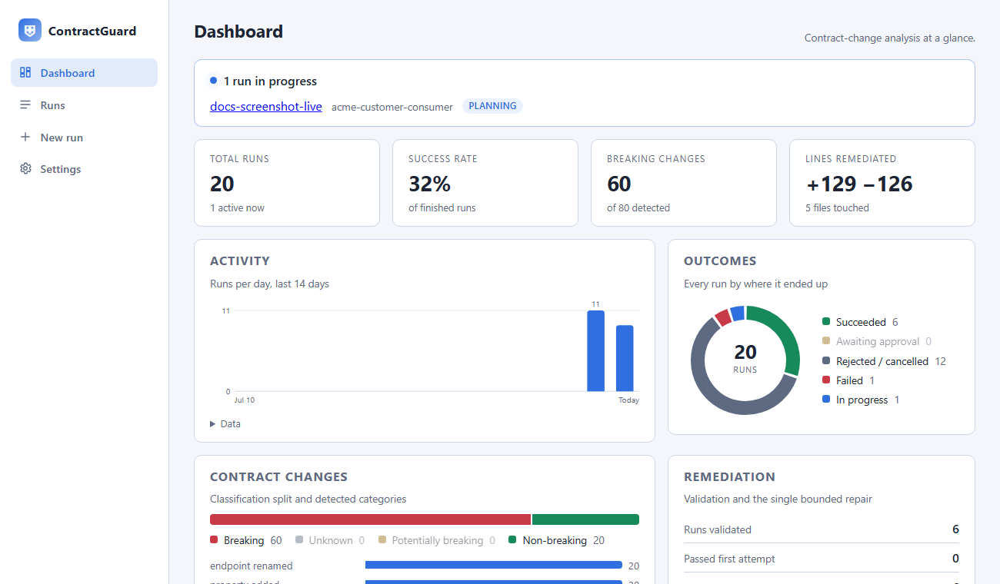
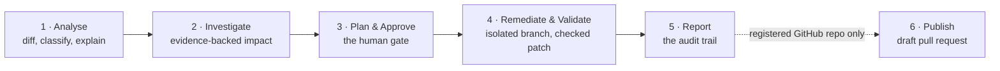
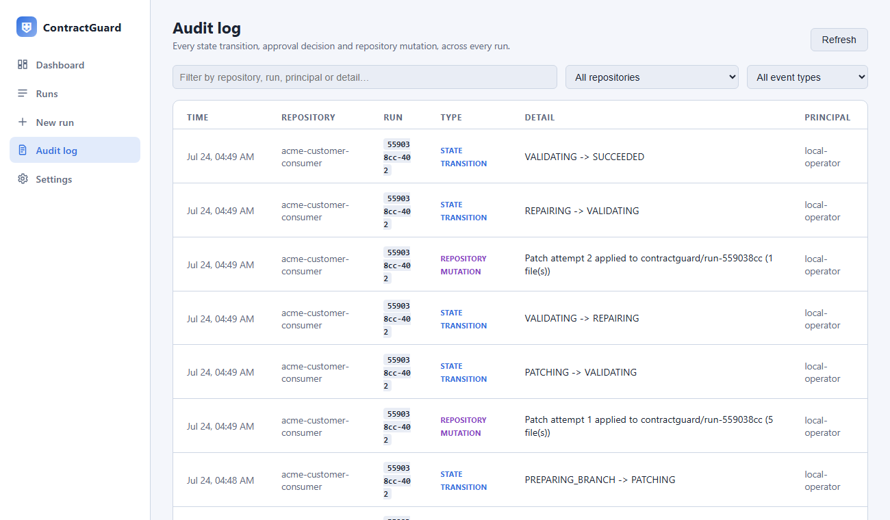

# ContractGuard AI — Usage Guide

The web app is organised into five pages: a statistics **Dashboard**, **Runs**
(history and per-run detail), **New run**, the org-wide **Audit log**, and
**Settings** (source registration, theme). This guide walks through a full
run end to end, then covers each feature area in depth.

## Dashboard

Run activity over time, outcome and classification breakdowns, change-type
distribution, and remediation stats (first-pass vs. repaired runs, average
validation time, lines added/removed, files touched) — all computed
server-side from the persisted run history (`GET /api/statistics`) and
rendered as dependency-free SVG charts.



## How a run flows

A run walks a strict state machine from `CREATED` to a terminal state; every
step is streamed live to the run's timeline and persisted for the final
report.



### 1 — Analyse: diff, classify, explain

Pick the consumer repository and the old/new specifications on **New run**,
then start the analysis (a local workspace checkout, or a registered GitHub
repository — see [Remote repositories](#remote-repositories) below). The
backend validates inputs, computes a deterministic diff of the two specs,
classifies each change (`BREAKING` / `NON_BREAKING` / `POTENTIALLY_BREAKING` /
`UNKNOWN`) by fixed policy, and has the LLM explain the consumer consequences
of each fact it is given — it cannot add or remove changes. A pinned progress
indicator tracks the run's whole lifecycle and expands to a full timeline of
every step, tagged by who acted (tool, LLM, human, system).


### 2 — Investigate: evidence-backed consumer impact

Deterministic text search collects file-and-line evidence for every breaking
change, then the impact investigator (a bounded agent with exactly two tools:
`search_repository` and `read_source_file`, limited by a step budget) assesses
severity and failure mode per affected component. Every assessment must cite
collected evidence IDs — uncited claims are rejected by the backend.


### 3 — Plan and approve: the human gate

The migration planner turns assessments into a versioned plan: objectives,
exact files, tests to update, validation command, risk and rollback per item.
Nothing has touched the repository yet. Approval is recorded against the exact
plan hash — if the plan changes, the approval is void; a rejection ends the
run with the repository untouched.


### 4 — Remediate and validate: isolated branch, checked patch

After approval, ContractGuard verifies the repository is clean, creates
`contractguard/run-<id>` off the current branch, and applies a
backend-computed patch restricted to the approved files (verified with
`git apply --check`, secret-scanned, never touching the original branch). The
consumer's own test suite then validates the result; one bounded repair
attempt is allowed after a failed validation. The patch is browsable per file
with git-style line numbers and syntax highlighting.


### 5 — Report: the audit trail

Every run ends with deterministic Markdown and JSON reports rendered from
persisted state — spec hashes, classified changes, evidence, assessments, the
approved plan and decision, patches, validation output, honest limitations and
the full event trace.


### 6 — Publish: push and open a draft pull request

Once remediation succeeds against a registered GitHub repository, a
**Publish** card offers a button that commits the working branch under a
fixed `ContractGuard` bot identity, pushes it and opens a **draft** pull
request whose body embeds the plan hash and links evidence back into the
target repository — a distinct, explicit action from Execute, never
automatic. The PR link then shows directly in the card; a failed publish can
be retried once the underlying issue (e.g. an expired token) is fixed.


## CI gate (headless CLI)

The same jar runs as an analysis-only gate for pull requests — no server, no
remediation, mock LLM by default so it needs no key:

```bash
java -jar contractguard-backend.jar \
  --spring.profiles.active=cli \
  --contractguard.workspace.roots=/checkouts \
  --contractguard.specs.directory=/specs \
  --contractguard.cli.repository=consumer-repo \
  --contractguard.cli.old-spec=api-main.yaml \
  --contractguard.cli.new-spec=api-proposed.yaml \
  --contractguard.cli.fail-on=breaking \
  --contractguard.cli.output=contractguard-report.json
```

Exit codes: `0` no gated changes, `1` analysis failed, `2` gated changes
found. `fail-on` accepts `breaking` (default), `potentially-breaking` (also
gates potentially-breaking and unanalysed change categories) or `none`
(report only). Ready-made wrappers live in
[integrations/github-action](../integrations/github-action/action.yml) and
[integrations/gitlab](../integrations/gitlab/contractguard-gate.yml); the
consumer checkout must be a Git repository with a Maven wrapper.

## Remote repositories

Consumers do not need a pre-existing local checkout. On the **Settings**
page, register a GitHub repository, supplying a clone URL, default branch
and a personal access token (`repo` scope) — the server needs
`CONTRACTGUARD_CREDENTIAL_KEY` set (a base64 256-bit key, e.g.
`openssl rand -base64 32`) before it will accept one. The registered
repository then appears in the **Consumer repository** picker under
"Registered GitHub repositories", alongside any local workspace repos, and
can be removed again from the same Settings section (which also deletes its
local clone cache) if it was registered with the wrong URL or an
under-scoped token. Or register it directly over the API:

```bash
export CONTRACTGUARD_CREDENTIAL_KEY=$(openssl rand -base64 32)  # server-side master key
curl -X POST http://localhost:7080/api/repositories/remote \
  -H 'Content-Type: application/json' \
  -d '{"repositoryId":"customer-consumer",
       "cloneUrl":"https://github.com/acme/widgets",
       "defaultBranch":"main","token":"ghp_..."}'
```

Creating a run against a registered repository clones (or refreshes) it into
`storage.directory/remote-cache/` automatically — everything downstream
(diff, evidence search, execution) works exactly as it does for a local
workspace repository. Once a run reaches `SUCCEEDED`, a **Publish** card
offers a button that commits, pushes the working branch and opens a draft
pull request, then shows the PR link; nothing is ever pushed without that
explicit click (or the equivalent `POST /api/runs/{id}/publish` call).
See [ADR-0007](adr/0007-remote-repository-access.md) for the credential
and transport design, and
[docs/demo-script.md §9](demo-script.md#9-test-remote-repositories-and-publishing-fr-027)
for a full walkthrough against a real GitHub repository.

## Specification sources

Old/new OpenAPI specs no longer have to live in a directory the server
process can already see. The **Settings** page offers three ways to get
specs in front of a run, all landing in the same picker on the **New run**
form:

- **Bundled/local** — files already in `contractguard.specs.directory`, as before.
- **Upload** — pick a file from your machine (`.yaml`/`.yml`/`.json`, 2 MB
  cap); it's stored under `storage.directory/uploaded-specs/` and available
  immediately. Re-uploading the same file name replaces it.
- **A registered spec repository** — like remote consumer repositories, but
  read-only and, unlike them, **the token is optional**: a public repository
  (this project's own demo specs, for instance) needs no credential at all.
  A registered spec source is cloned/refreshed every time setup options are
  requested, so it always reflects the latest commit on its default branch.

```bash
# Public repository: no token, no CONTRACTGUARD_CREDENTIAL_KEY needed.
curl -X POST http://localhost:7080/api/spec-sources \
  -H 'Content-Type: application/json' \
  -d '{"repositoryId":"openapi-specs",
       "cloneUrl":"https://github.com/acme/openapi-specs","defaultBranch":"main"}'

# Upload a file directly (multipart):
curl -X POST http://localhost:7080/api/specs -F file=@customer-api-v2.yaml
```

Every spec offered at run creation carries a qualified ID
(`local:<name>`, `upload:<name>`, `source:<repositoryId>:<name>`) so files
with the same name from different origins never collide; a bare file name
(what the headless CLI gate has always sent) still resolves against the
local directory unchanged. See
[ADR-0012](adr/0012-spec-source-repositories-and-upload.md) for the
full design.

## Audit trail

Every state transition, approval decision and repository mutation is
recorded to a separate, append-only audit log — distinct from the
operational timeline: it is never purged by the retention policy that
deletes finished runs, and there is no API route to edit or delete an entry.

Each run's detail page has its own **Audit trail** section (load-on-demand,
staying live for the rest of the run); the **Audit log** page shows every
entry across every run, filterable by repository, event type or free text,
each row linking back to its run:



The same data is available directly from the API:

```bash
curl 'http://localhost:7080/api/audit?runId=<runId>'          # one run
curl 'http://localhost:7080/api/audit?repositoryId=<repoId>'  # one repository, across runs
curl 'http://localhost:7080/api/audit'                        # everything
```

`principal` is a single operator-configured placeholder
(`contractguard.audit.default-principal`) until FR-024 (authentication)
lands — see [ADR-0008](adr/0008-audit-trail.md).

## Notifications

A run reaching a state that needs a human's attention — awaiting approval,
succeeded, failed, or failed to publish — raises an in-app toast wherever
you are in the dashboard, and can also POST to a webhook (Slack-compatible
out of the box) so a team doesn't have to keep it open. The webhook is
opt-in and off by default; see
[Outbound notifications](configuration.md#outbound-notifications) to
configure it. See [ADR-0016](adr/0016-outbound-run-notifications.md) for
the design.

## Verification

```bash
# Backend: unit, adapter, API, agent and architecture tests + coverage,
# Checkstyle and SpotBugs (all build-breaking)
cd backend && ./mvnw verify

# Backend incl. the full end-to-end demo test (real git + real mvnw verify)
cd backend && ./mvnw verify -Pe2e

# Persistence adapters against real PostgreSQL (requires Docker)
cd backend && ./mvnw test -Ppg

# Sandboxed-validation adapter against real docker run (requires Docker)
cd backend && ./mvnw test -Pdocker

# Frontend: lint, tests with coverage, production build
cd frontend && npm ci && npm run lint && npm run test:coverage && npm run build
```

CI (`.github/workflows/ci.yml`) runs all of the above from a clean checkout.

## Safety guarantees

- No source modification before a recorded human approval of the exact plan
  hash; a changed plan invalidates approval.
- Repository access confined to workspace roots; symlink escapes and likely
  secret files rejected; vendored build tooling never becomes evidence.
- Patches are computed by the backend, verified with `git apply --check`,
  restricted to approved files, and rejected if credential-shaped content
  appears. All mutations happen on `contractguard/run-<id>`; the original
  branch is never touched.
- Remote operations (clone, fetch, push, opening a pull request) only exist
  for repositories explicitly registered via `POST /api/repositories/remote`,
  and pushing/opening a PR is a separate, explicit `POST
  /runs/{id}/publish` call — never automatic. Credentials are AES-256-GCM
  encrypted at rest and never appear in a process argument list (ADR-0007).
- Process execution uses fixed argument arrays with timeouts and output caps;
  model output is never executed.
- At most one repair attempt after a failed validation, enforced structurally.
- Every state transition, approval decision and repository mutation is
  recorded to an append-only audit log with no API route to edit or delete
  an entry; unlike the operational timeline, it is never purged by the
  retention policy (ADR-0008).
- A per-repository lock closes the race where two simultaneous requests
  could both pass the "is this repository busy?" check before either run
  was written; the system-wide run queue is explicitly bounded
  (`concurrency.max-active-runs`) rather than relying on an unbounded
  thread-pool queue. A run interrupted by a restart while still `CREATED`
  is safely resumed from scratch; every other interrupted state is
  finalised as FAILED with a clean message rather than resumed mid-mutation
  (ADR-0009).
- Consumer builds can run in a resource-limited, network-isolated container
  instead of on the host (opt-in, `validation.docker.enabled`); a timed-out
  sandboxed build is killed and its container removed rather than left
  running (ADR-0010). See [Configuration reference](configuration.md) for
  how to enable it.

## Known limitations

- Automated remediation covers endpoint renames, property renames and enum
  value removals; other breaking categories are reported with evidence but
  migrated manually.
- Evidence collection is text-search based; dynamically constructed
  references can be missed.
- One repository, Maven builds and OpenAPI 3.x only (see the specification, §4).
- Resuming a run interrupted mid-flight is supported only for runs still
  `CREATED` (FR-032); anything past that point (mid-diff, mid-patch,
  mid-publish, ...) is finalised as FAILED on restart with an explanatory
  message rather than resumed, since the state machine's transitions are
  intentionally one-shot (ADR-0009).
- Remote repository support (FR-027) is GitHub-only, HTTPS-token-only: no
  GitLab/Bitbucket and no SSH yet. The draft pull request links evidence back
  to GitHub blob URLs rather than a ContractGuard report link, since the
  server binds to loopback only and has no public URL by default.
- The dashboard's registration form and Publish button assume one operator
  per instance; there is no per-user credential scoping or role separation
  yet (see roadmap FR-024, Authentication and Authorisation).
- The audit trail (FR-025) attributes every entry to one configured
  principal, not a real authenticated identity, for the same reason.
- Sandboxed validation (FR-030) has no `--user` mapping into the container,
  so build output may end up root-owned on a Linux host; and network access
  is genuinely off by default, so a repository whose dependencies were
  never resolved on the host will fail rather than fetch them.
- Observability (FR-029) ships tracing, metrics and health endpoints, but
  not structured JSON logs — that needs Spring Boot 3.4, and this project's
  parent POM is pinned to 3.3.5 (ADR-0011). Trace export defaults to the
  application log; a real collector needs `management.otlp.tracing.endpoint`
  configured.
- Registered repositories, spec sources and uploaded specifications (FR-044)
  can be deregistered/deleted, but the registry is still process-wide, not
  scoped to any user — the same single-operator trust model as everything
  else pending FR-024 (ADR-0012).
